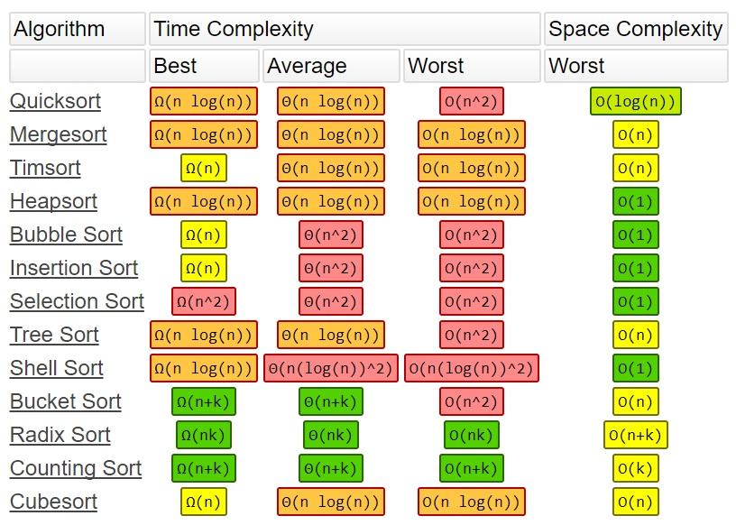

# push_swap
42 Heilbronn #42

# Sources

When I started the project, like everyone else, I first searched for "push_swap" on Google. The algorithm written by Jamie Dawson in the Medium link I shared below was very clear to me.

https://medium.com/@jamierobertdawson/push-swap-the-least-amount-of-moves-with-two-stacks-d1e76a71789a

# Install
Clone the push_swap into the directory.

<git clone git@github.com:phlvnhalime/push_swap.git>

then you write;

<make>

# How can you test it?

# THE RULES FOR PROJECT
You have 2 stacks named a and b.
• At the beginning:
◦ The stack a contains a random amount of negative and/or positive numbers
which cannot be duplicated.
◦ The stack b is empty.
• The goal is to sort in ascending order numbers into stack a. To do so you have the
following operations at your disposal:
sa (swap a): Swap the first 2 elements at the top of stack a.
Do nothing if there is only one or no elements.
sb (swap b): Swap the first 2 elements at the top of stack b.
Do nothing if there is only one or no elements.
ss : sa and sb at the same time.
pa (push a): Take the first element at the top of b and put it at the top of a.
Do nothing if b is empty.
pb (push b): Take the first element at the top of a and put it at the top of b.
Do nothing if a is empty.
ra (rotate a): Shift up all elements of stack a by 1.
The first element becomes the last one.
rb (rotate b): Shift up all elements of stack b by 1.
The first element becomes the last one.
rr : ra and rb at the same time.
rra (reverse rotate a): Shift down all elements of stack a by 1.
The last element becomes the first one.
rrb (reverse rotate b): Shift down all elements of stack b by 1.
The last element becomes the first one.
rrr : rra and rrb at the same time.

